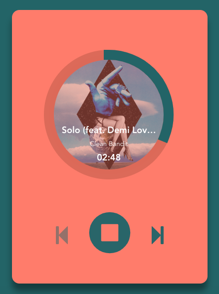

# PowerFM Unofficial Refactor Repository

It's refactor PowerFM with no-frameworks and libraries, created for fun. it's uses [FetchAPI](https://developer.mozilla.org/en-US/docs/Web/API/Fetch_API), [HTML Audio Media element](https://developer.mozilla.org/en-US/docs/Web/HTML/Element/audio), SVG and that's all.

## Preview and Contributions

On Internet: Click [here](https://coskuntekin.github.io/PowerFM)

On your local: After clone the repository you can use `python -m SimpleHTTPServer`

## ScreenShot

## Assets Sources

- Stream Source: http://www.powerapp.com.tr/powerfm
- Design: https://dribbble.com/shots/1007664-Music-Player
- Icons: https://fontawesome.com
